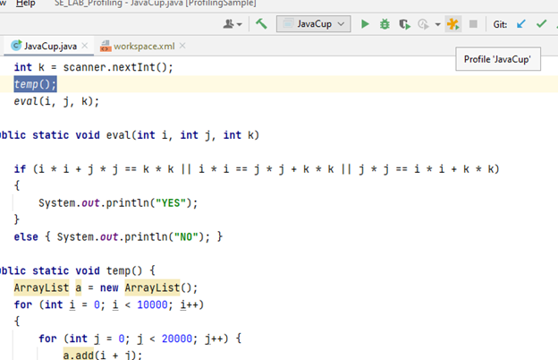
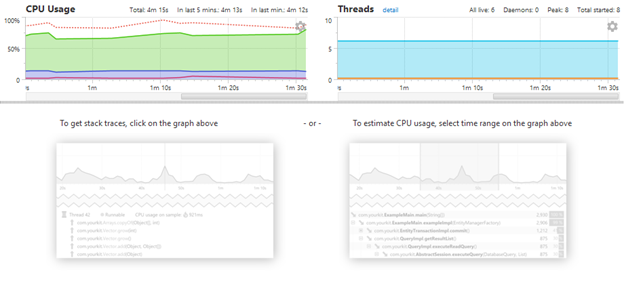
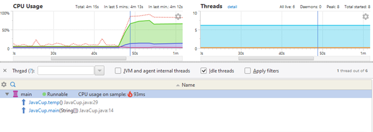
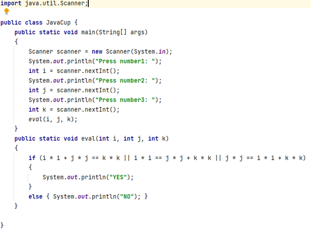

### بخش اول

 
در بالا میتوانید کد کلاس جاوا کاپ را که باید مشکل آن را برطرف نماییم و تابعی که بیشترین مصرف منابع را دارد شناسایی کنیم.
این کد در محیط اینتلیج که داریم تا خط 14 بیشتر اجرا نمیشود و بعد از آن به ارور زیر میخوریم:

 دلیل این ارور نیز همان طور که در بالا قابل مشاهده است java heap space میباشد که در تابع temp() در حال پر کردن و دسترسی به آن هستیم.
جدای از این ارور که به آن بر میخوریم میرویم و این کلاس را با استفاده از ابزار معرفی شده مورد بررسی و تحلیل قرار میدهیم.
حال عملیات Profiling را با استفاده از Yourkit بر روی کلاس JavaCup اجرا نموده و تابعی از پروژه که بیش‌ترین مصرف منابع را دارد شناسایی میکنیم. که درواقع انتظار داریم همان temp() که در خط 14 مشکل ساز بود برای ما نمایان شود.
آغاز عملیات :

 
نمایش نمودار:

 
بعد از دریافت ورودی :
 
 

 
 همان طور که در بالا مشاهده میکنید بعد از دریافت ورودی به طور عجیبی در همان لحظه 50 ما افزایش cpu usage را مشاهده میکنیم و این تا زمانی که برنامه با اروری که در بالا مشاهده میکنید به اتمام نرسد ادامه خواهد داشت.
حال برای پیدا کردن تابع پرمصرف به شکل زیر عمل میکنیم:
روی قسمت مشکوک کلیک میکنیم تا ببینیم از کجا نشات گرفته است(به طور مثال روی نقطه سبز کلیک میکنیم):

 

حال با تصویر زیر روبرو خواهیم شد:

 
همان طور که میبینیم دلیل این جهش در CPU usage مشخص گردید و حال باید به اصلاح بپردازیم.
برای اصلاح با توجه به اینکه تابع temp() یک تابعی از که هیچ کاربردی ندارد میتوانیم آن را حذف کنیم یا چنانچه میخواهیم زمان خودمان را هدر داده یا زمان بخریم تا خروجی چاپ شود میتوانیم از توابع آماده خود جاوا برای wait کردن استفاده کنیم. 
اما از آنجا که در صورت سوال چنین چیزی از ما نخواسته است ما فرض را بر آن میگیریم که چنین کاری نیاز نیست و تابع temp() یک تابع بدون فایده و بلکه مخرب و مضر است و آن را خذف میکنیم و اکنون دوبار با استفاده از ابزاری که در اخیار داریم اجرا میگیریم.
کلاس جدید:

 
حال با اجرای کد جدید به اروری بر نمیخوریم و CPU usage را نیز بسیار کاهش داده ایم و این از نمودار زیر که ابزار مذکور در اخیار ما قرار داده و در زیر میتوانید مشاهده کنید میتوان برداشت کرد.
 

### بخش دوم

برنامه ای که برای profile کردن و بهبود دادن آن در نظر گرفته شده است برنامه ای برای concatenation میان دو رشته است. در ابتدا از روش نامناسبی استفاده شده است که میتوانیم در نمودار نیز ببینیم که این برنامه سربار زیادی برای cpu خواهد داشت. اما در بخش بعد از stringbuffer‌ استفاده شد که بسیار در مصرف منابع cpu صرفه جویی کرد.

